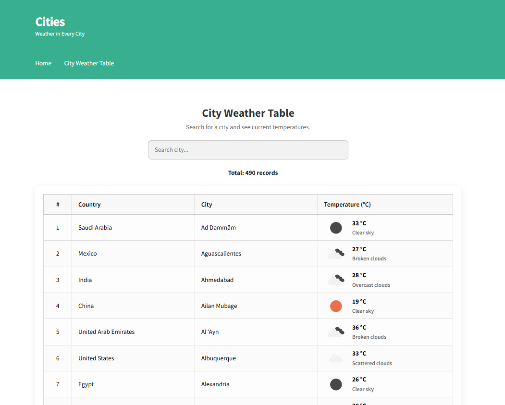

# 🌤️ Cities Weather — расширение темы Storefront

Этот дочерний шаблон WordPress (child theme) для темы **Storefront** добавляет функциональность отображения погоды для различных городов. Проект использует API OpenWeatherMap, собственный тип записей (CPT), кэширование, обновление погоды по расписанию и виджет для вывода по выбранному городу.

---

## 📸 Скриншоты интерфейса

| Виджет на главной | Таблица погоды |
|----------------|-------------------|
|  |  |

---

## 📂 Структура проекта

```text
storefront-child/
├── README.md                                   Документация по проекту
├── screenshot.png                              Скриншот темы для отображения в админке WP
├── style.css                                   Заголовок темы + базовые стили
├── functions.php                               Подключение всех компонентов темы
│
├── assets/                                     
│   ├── css/
│   │   └── cities-weather.css                  Стили для вывода таблицы погоды, виджета, пагинации
│   └── js/
│       └── cities-ajax.js                      AJAX-обработка на стороне клиента
│
├── inc/                                        
│   ├── ajax-cities.php                         AJAX-обработчики (запросы погоды)
│   ├── cpt-cities.php                          Регистрация типа записи "Cities"
│   ├── metabox-city-coordinates.php            Метабоксы с "latitude" и "longitude"
│   ├── taxonomy-countries.php                  Регистрация таксономии "Countries"
│   ├── weather-cache-batch-updater.php         Обновление кэша погоды пакетами
│   └── widget-weather.php                      Виджет для вывода погоды
│
├── templates/
│   └── cities-weather-table.php                Шаблон таблицы с погодой
```

## 🔐 Безопасность
- API-ключ хранится на сервере(wp-config.php) и не попадает во frontend
- Обновление погоды по URL защищено секретным ключом.
- Кэш погоды хранится через transient, не нагружает базу данных.
```bash
define('OPENWEATHERMAP_API_KEY', 'API_KEY');
define('WEATHER_UPDATE_SECRET', 'SECRET_PASSWORD');
```

<br><br>
## 📖 Подробное описание логики работы

В этом разделе описано, как реализованы ключевые механизмы проекта: хранение городов и стран, отображение погодных данных, обновление кэша и взаимодействие с API OpenWeatherMap.

### 1. Структура хранения данных

Каждый город представлен как отдельная запись пользовательского типа (CPT) `Cities`. У него есть:
- Название (`post_title`);
- Географические координаты (`latitude`, `longitude`);
- Страна — через пользовательскую таксономию `Countries`;
- Кэшированное значение температуры, сохранённое с помощью `transient`.

### 2. Получение и кэширование погоды

При обновлении:
- Обновление температуры выполняется автоматически через сайт cronjob.org, который раз в минуту обращается к специальному URL с секретным ключом.

- Сервер обрабатывает по 20 городов в минуту с помощью функции update_weather_cache_batch(). Для каждого города отправляется отдельный запрос к API OpenWeatherMap, независимо от кэша.

- Полученные данные сохраняются через set_transient() на 1 час, но благодаря циклическому обновлению все города получают актуальную температуру максимум раз в 25 минут.

- Размер батча (20) выбран с учётом лимита 60 запросов в минуту на бесплатном тарифе OpenWeatherMap и добавленных пауз (usleep) между запросами, чтобы избежать превышения лимита и ошибок тайм-аута.

### 3. Отображение таблицы погоды

- Файл templates/cities-weather-table.php отображает таблицу с городами и текущей температурой. Данные подгружаются через AJAX (action: load_cities) с поддержкой поиска, сортировки и пагинации.

- Клиентская часть реализована на jQuery: запросы отправляются по мере ввода (с debounce), таблица обновляется без перезагрузки. Пагинация отображается динамически, постранично по 20 городов. Всего используются стандартные механизмы WordPress (wp_enqueue_script, admin-ajax.php).

### 4. Виджет погоды

- Виджет позволяет пользователю выбрать город и отобразить его текущую температуру.

- Виджет показывает погоду выбранного города (температура, иконка, описание) по координатам (широта и долгота), заданным у поста типа cities.

- Данные о погоде берутся из кэша (transient); если кэша нет, вызывается функция get_temperature() — она может использовать AJAX-файл ajax-cities.php для обновления.

- В админке виджета доступен выпадающий список стран (таксономия countries) и вложенных городов (post_type cities), всё отсортировано по алфавиту.

